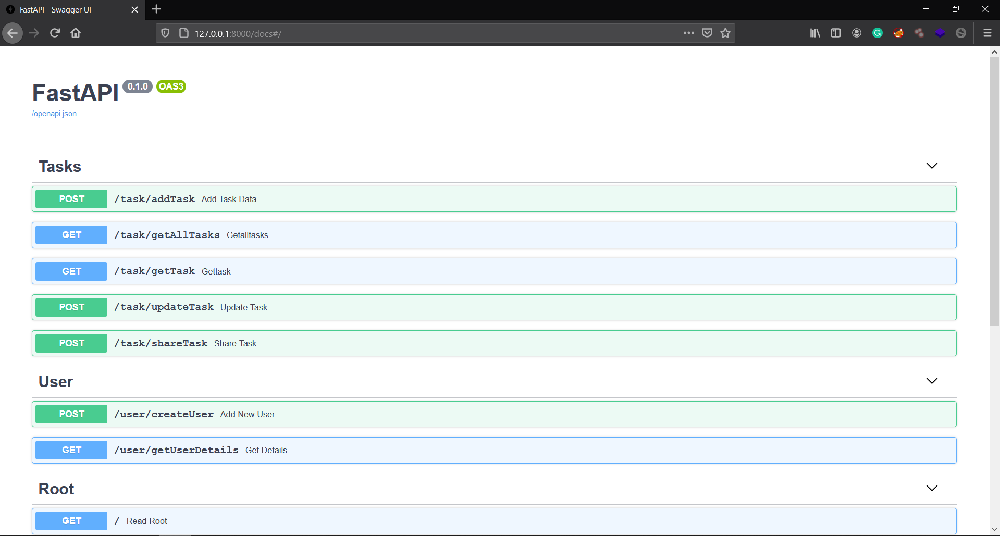

# Task_Project
Repository holds a Backend coded in Python using FASTAPI (framework) and Motor (mongo-driver) as a Task

### Steps to run
    git clone https://github.com/Mayuresh-Github/Task_Project.git
    cd Task_Project
    deactivate (Deactivate any virtual enviroments)
    virtualenv test_env (Create a new virtual enviroment for this project)
    source test_env/bin/activate
    pip install -r requirements.txt (Install the required packages)
    cd task_project
    python main.py
    
  - Navigate to http://127.0.0.1:8000/docs#/.  
  This is SwaggerUI for interaction and testing the REST APIs.
  

